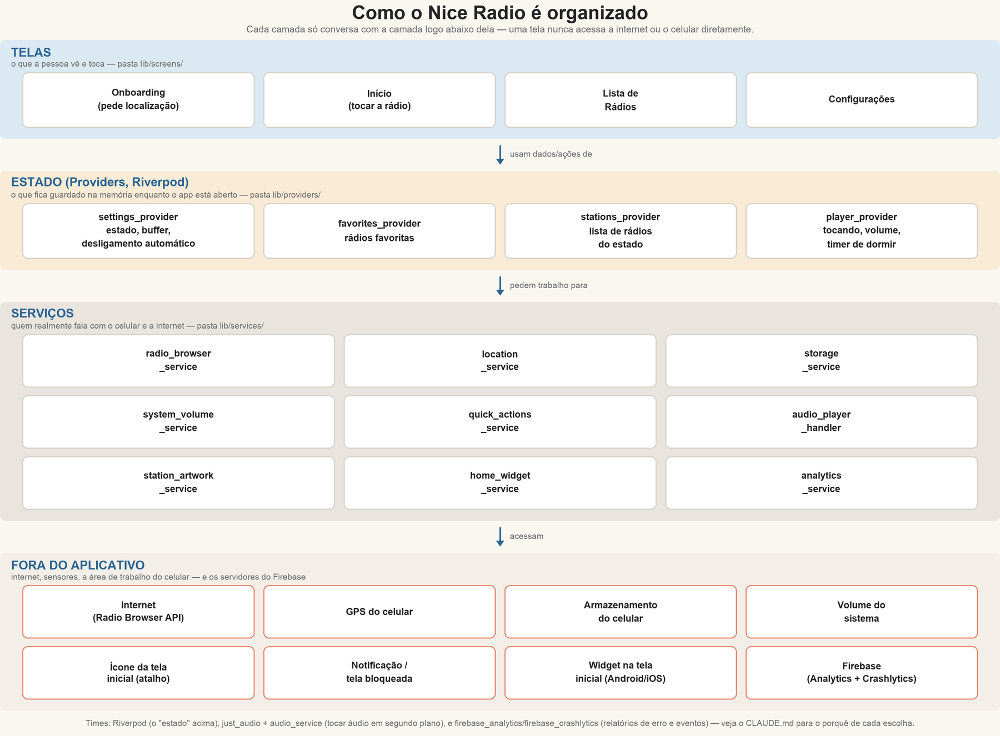

# 📻 Nice Radio

Aplicativo de rádio online simples e acessível, pensado para idosos.
Uma tela só, botões grandes, sem menus escondidos: escolher a estação,
tocar/pausar, ajustar o volume e favoritar uma rádio.

Este documento é para **qualquer pessoa** que precise pegar este
projeto do zero e conseguir rodá-lo — mesmo sem nenhuma experiência
prévia com Flutter, Xcode ou Android Studio. Se você é
desenvolvedor(a) e quer entender o *porquê* de cada decisão técnica
(por que essa biblioteca e não outra, por que essa cor, o que já foi
tentado e não funcionou), os comentários no código-fonte têm esse nível
de detalhe (em inglês); este README fica no nível "o que é e como faço".

---

## Sumário

1. [O que o aplicativo faz](#-o-que-o-aplicativo-faz)
2. [Como rodar o aplicativo (passo a passo)](#-como-rodar-o-aplicativo-passo-a-passo)
3. [Configurando o Xcode (iOS)](#-configurando-o-xcode-para-o-projeto-funcionar-ios)
4. [Mantendo o widget no Android Studio](#-mantendo-o-widget-da-tela-inicial-no-android-studio)
5. [Permissões que o aplicativo usa](#-permissões-que-o-aplicativo-usa)
6. [Relatórios de erro e de uso (Firebase)](#-relatórios-de-erro-e-de-uso-firebase)
7. [Onde ir para fazer as principais alterações](#-onde-ir-para-fazer-as-principais-alterações)
8. [Ícones e imagens do projeto](#-ícones-e-imagens-do-projeto)
9. [Como o código é organizado (arquitetura)](#-como-o-código-é-organizado-arquitetura)
10. [Estrutura de pastas do projeto](#-estrutura-de-pastas-do-projeto)
11. [Principais dependências](#-principais-dependências)
12. [Builds automáticos (GitHub Actions)](#-builds-automáticos-github-actions)
13. [Conferindo se está tudo funcionando](#-conferindo-se-está-tudo-funcionando-para-quem-for-mexer-no-código)

---

## 📖 O que o aplicativo faz

Quando a pessoa abre o Nice Radio pela primeira vez:

1. O app pede permissão de localização e descobre em qual **estado do
   Brasil** ela está (só uma vez, nunca fica guardado nem é enviado a
   lugar nenhum além dessa consulta).
2. Ele busca as rádios daquele estado numa base de dados aberta e
   gratuita (a [Radio Browser API](https://www.radio-browser.info/)),
   já ordenadas pela frequência — como um dial de rádio de verdade —
   e mostrando a frequência primeiro no nome de cada estação (ex.:
   "94,7 FM — Antena 1").
3. A pessoa vê uma tela só com: a rádio atual, um botão grande de
   tocar/pausar, botões de **+** e **−** para o volume (de 10% em
   10%), uma estrela para favoritar e um "timer de dormir". Não existe
   botão de viva-voz: o app decide sozinho, toda vez que a rádio começa
   a tocar, se deve forçar o som pelo alto-falante do aparelho — só
   quando não há nenhum fone/caixa Bluetooth ou com fio conectado
   naquele momento (veja `PlayerNotifier._updateSpeakerForConnectedDevices`
   em `lib/providers/player_provider.dart`).
4. Se a rádio estiver tocando uma música com nome disponível, aparece
   um botão para **copiar o nome da música**.
5. A rádio continua tocando (e pode ser controlada pela tela de
   bloqueio/notificação — incluindo os botões de avançar/voltar, que
   trocam de estação) mesmo com o aplicativo em segundo plano — como
   qualquer app de música. Se outro aplicativo tocar ou gravar um
   áudio curto (ex.: um áudio de WhatsApp), a rádio pausa sozinha e
   volta a tocar quando o áudio termina, em vez de continuar tocando
   por cima.
6. Em Configurações, dá para trocar o estado manualmente e ver/zerar
   uma estimativa de dados usados.
7. Segurando o dedo no ícone do app na tela inicial do celular, aparece
   um atalho "Tocar rádio atual" que já religa a última rádio ouvida.
8. Um ícone de lâmpada ao lado de Configurações liga/desliga o **modo
   noturno** — é uma escolha manual, nunca automática (letras claras em
   fundo escuro podem ser mais difíceis de ler para quem tem catarata,
   então quem decide é a pessoa, não o celular).
9. No Android, a rádio também aparece no **Android Auto** do carro (lista
   de estações + play/pause/parar), e os controles básicos de "tocando
   agora" chegam ao **CarPlay** do mesmo jeito que chegam à tela
   bloqueada do iPhone.
10. Se 3 rádios seguidas falharem ao conectar, aparece um aviso
    explicando que algumas estações estão fora do ar — com uma opção de
    "não mostrar novamente" (já vem marcada, mas dá pra desmarcar). Uma
    rádio isolada que falha só mostra um aviso pequeno embaixo dos
    controles, sem interromper o uso.
11. A aba **Favoritas/Todas** fica lembrada: se a pessoa fechar o app
    com "Favoritas" selecionada, ele reabre já nela (e vice-versa), em
    vez de sempre voltar para "Todas". Se a aba "Todas" não conseguir
    carregar nenhuma estação, o próprio botão de play/pause vira um
    ícone de atualizar, para tentar buscar a lista de novo.
12. Se a internet cair **enquanto uma rádio está tocando**, o botão de
    tocar/pausar mostra o ícone de carregando e o app tenta se
    reconectar sozinho, em segundo plano, por até um minuto, antes de
    mostrar qualquer erro. Trocar de estação pelos botões de
    avançar/voltar também tenta reconectar dessa mesma forma, mesmo sem
    sinal no momento.
13. Dá para adicionar um **widget na tela inicial do celular** (Android e
    iOS) com o nome da rádio/música atual, uma caixinha com o logo da
    rádio, e botões de voltar/tocar-pausar/avançar — sem precisar abrir
    o app.

---

## 🚀 Como rodar o aplicativo (passo a passo)

Existem três formas de rodar o app, da mais simples para a mais
completa:

| Onde | Exige instalar | Recursos que funcionam |
|---|---|---|
| **Chrome (navegador)** | só o Flutter | quase tudo, exceto volume real do aparelho, atalho no ícone e tocar em segundo plano |
| **Simulador de iOS** | um Mac + Xcode | tudo, exceto o volume/fones Bluetooth reais (o simulador não tem hardware de áudio de verdade) |
| **Emulador Android** | Android Studio + SDK | tudo |

As seções abaixo assumem que você **nunca configurou nada disso
antes** — siga na ordem.

### O que você precisa, em qualquer caso

- Um computador (para iOS, precisa ser um **Mac** — não tem como rodar
  um simulador de iPhone em Windows/Linux).
- Uma conexão com a internet.
- Uns 20–30 minutos livres na primeira vez (o tempo é quase todo gasto
  baixando ferramentas, não o projeto em si). Configurar Android ou
  iOS do zero pela primeira vez pode levar bem mais que isso (o Xcode
  sozinho tem alguns GB).

### Passo 1 — Instalar o Flutter

O Flutter é a ferramenta que "transforma" este código num aplicativo.

1. Acesse <https://docs.flutter.dev/get-started/install> e siga as
   instruções para o seu sistema operacional (existe um instalador
   simples para Mac, Windows e Linux).
2. Ao final, abra um terminal e rode:

   ```bash
   flutter doctor
   ```

   Esse comando confere se está tudo certo. Não precisa resolver
   *todos* os avisos agora — o importante é a linha do Flutter
   aparecer com um ✓. Os avisos de Android/iOS somem conforme você
   segue os passos abaixo.

### Passo 2 — Baixar o código deste projeto

Se você recebeu a pasta do projeto (por e-mail, pendrive, etc.), pule
para o Passo 3. Se for baixar do zero, com o [Git](https://git-scm.com/)
instalado:

```bash
git clone <endereço-do-repositório>
```

### Passo 3 — Abrir o terminal dentro da pasta do projeto

```bash
cd caminho/até/nice-radio
```

(Troque `caminho/até/nice-radio` pelo caminho real da pasta no seu
computador.)

### Passo 4 — Instalar as dependências do projeto

```bash
flutter pub get
```

Isso baixa todas as bibliotecas de que o app precisa (veja a seção
"Principais dependências" mais abaixo). Só precisa rodar de novo se o
arquivo `pubspec.yaml` mudar.

### Passo 5 — Rodar no Chrome (o caminho mais rápido)

```bash
flutter run -d chrome
```

Uma aba do Chrome vai abrir sozinha com o app rodando. Para fechar,
volte ao terminal e digite `q`.

> **Nota sobre o navegador:** algumas coisas (o volume real do
> aparelho, o atalho no ícone, tocar em segundo plano, o widget) não
> funcionam no navegador — essas dependem do celular de verdade. Elas
> são ignoradas silenciosamente no Chrome, sem travar o app; é assim
> de propósito, para dar para testar o resto sem precisar de celular.

### Passo 6 (opcional) — Rodar no Simulador de iOS, do zero

Só funciona num **Mac**. Se você já tem Xcode instalado e um simulador
já configurado, pule direto para o final desta seção.

1. **Instalar o Xcode.** Abra a **App Store** no Mac, procure por
   "Xcode" e instale (é grátis, mas é grande — vários GB — então isso
   pode demorar). Você também pode usar o site
   <https://developer.apple.com/xcode/> se preferir baixar fora da App
   Store.
2. **Abrir o Xcode uma vez** depois de instalado, para ele terminar de
   configurar componentes internos. Aceite os termos de uso quando
   perguntado.
3. **Aceitar a licença pelo terminal também** (o Xcode às vezes pede
   de novo aqui):

   ```bash
   sudo xcodebuild -license accept
   ```

   Vai pedir a senha do seu usuário do Mac.
4. **Apontar o sistema para o Xcode certo.** Isso resolve o erro mais
   comum ("Xcode is installed but not selected"):

   ```bash
   sudo xcode-select -s /Applications/Xcode.app/Contents/Developer
   ```
5. **Instalar o CocoaPods** (gerencia as bibliotecas nativas do lado
   iOS — o Flutter usa isso por baixo dos panos):

   ```bash
   brew install cocoapods
   ```

   (Se você não tem o [Homebrew](https://brew.sh/) ainda, instale-o
   primeiro — o site tem um comando de uma linha só para isso.)
6. **Ver quais simuladores já estão instalados:**

   ```bash
   xcrun simctl list devices available
   ```

   Se a lista vier vazia ou sem um iPhone recente, abra o Xcode → menu
   **Xcode → Settings → Components** (ou **Platforms**, dependendo da
   versão) e baixe um runtime de iOS ali.
7. **Ligar (bootar) um simulador** — troque `"iPhone 17"` pelo nome de
   um aparelho que apareceu no passo anterior:

   ```bash
   xcrun simctl boot "iPhone 17"
   ```
8. **Rodar o app:**

   ```bash
   flutter run
   ```

   Se houver mais de um dispositivo disponível (Chrome, simulador,
   etc.), o Flutter vai perguntar qual usar — escolha o simulador
   iOS na lista. Para já apontar direto, veja o nome com
   `flutter devices` e rode `flutter run -d <nome-ou-id>`.

**Problemas comuns nesta configuração** (e como resolver):

- *"Xcode is installed but not selected"* → repita o passo 4 acima.
- *"You have not agreed to the Xcode license agreements"* → repita o
  passo 3.
- *App trava sem motivo claro logo na primeira execução* → confira se
  o CocoaPods está instalado (passo 5); a primeira vez que o Flutter
  precisa dele, se ele não existir, o build falha com uma mensagem
  mencionando "pod install".

### Passo 7 (opcional) — Rodar no Emulador Android, do zero

Funciona em Mac, Windows ou Linux.

1. **Instalar o Android Studio**: baixe em
   <https://developer.android.com/studio> e siga o instalador — ele já
   vem com o SDK Manager, o Emulador e um JDK compatível.
2. **Abrir o Android Studio uma vez**, aceitar os termos, e deixar ele
   baixar os componentes que sugerir na primeira execução (SDK
   Platform, Build-Tools, etc.).
3. **Criar um emulador (AVD — Android Virtual Device):**
   - No Android Studio, vá em **More Actions → Virtual Device Manager**
     (ou o ícone de celular na barra de ferramentas).
   - Clique em **Create device**, escolha um aparelho (ex.: Pixel 6a),
     escolha uma imagem de sistema (qualquer uma com o selo "Google
     APIs" ou "Google Play" funciona; **não precisa** ser a mais nova
     lançada) e finalize.
4. **Conferir se o Flutter enxerga o Android SDK:**

   ```bash
   flutter doctor
   ```

   Se aparecer um X na linha do Android, normalmente é uma licença não
   aceita — resolve com:

   ```bash
   flutter doctor --android-licenses
   ```

   (aceite todas digitando `y`).
5. **Ligar o emulador** que você criou no passo 3:

   ```bash
   flutter emulators
   flutter emulators --launch <id-que-apareceu-na-lista>
   ```

   Ou, direto pelo Android Studio: abra o Virtual Device Manager e
   clique no ▶ ao lado do aparelho criado.
6. **Rodar o app** (com o emulador já ligado e de tela desbloqueada):

   ```bash
   flutter run
   ```

   Se aparecer mais de um dispositivo na lista, escolha o emulador
   Android. Para já apontar direto: `flutter devices` mostra o id
   (algo como `emulator-5554`), e você roda
   `flutter run -d emulator-5554`.

**Problemas comuns nesta configuração:**

- *`Could not resolve all files for configuration
  ':audio_service:androidJdkImage'`* (ou qualquer erro mencionando
  `JdkImageTransform`) → o Java "de fora" do projeto (o que aparece
  quando você digita `java -version` no terminal) está numa versão
  diferente da que o Gradle deste projeto espera (Java 17). Resolva
  apontando o Flutter para um JDK 17 já instalado, sem mexer no Java
  padrão do sistema:

  ```bash
  # No Mac, lista os JDKs instalados:
  /usr/libexec/java_home -V
  # Depois aponte o Flutter para um deles (ajuste o caminho conforme o listado):
  flutter config --jdk-dir="/Library/Java/JavaVirtualMachines/jdk-17.0.12.jdk/Contents/Home"
  ```
- *`avdmanager create avd` falha reclamando de um arquivo
  `devices.xml` ausente* → é uma falha conhecida de algumas imagens de
  sistema Android; normalmente **criar o AVD pela interface do Android
  Studio** (passo 3, em vez do comando `avdmanager` na mão) já evita
  esse problema.
- *Estações que usam `http://` (sem "s") não tocam no Android* → veja a
  seção de permissões abaixo — o projeto já lida com isso via
  `android:usesCleartextTraffic="true"` no `AndroidManifest.xml`; se
  isso um dia parar de funcionar após uma atualização do Android, é o
  primeiro lugar a conferir.

### Gerando um build para instalar de verdade (não só rodar no simulador)

```bash
flutter build apk          # gera um .apk instalável em qualquer Android
flutter build ios          # gera o build para a App Store/TestFlight (exige conta de desenvolvedor Apple para assinar)
```

O `.apk` do primeiro comando fica em
`build/app/outputs/flutter-apk/app-release.apk` e pode ser copiado
para um celular Android e instalado diretamente (pode ser necessário
permitir "instalar de fontes desconhecidas" nas configurações do
aparelho).

#### Assinando o release do Android (key.properties)

Sem nenhuma configuração extra, o `flutter build apk` acima ainda
funciona — mas o `.apk` gerado é assinado com a **chave de debug**
(a mesma que qualquer instalação do Android SDK já tem em
`~/.android/debug.keystore`), o que é suficiente para instalar e
testar em qualquer aparelho, mas **não pode ser publicado na Play
Store** dessa forma (o Play Console rejeita um upload assinado com
essa chave).

Para gerar um build de verdade, com uma chave própria:

1. Copie `android/key.properties.example` para `android/key.properties`
   (esse arquivo já é ignorado pelo git — nunca commite o de verdade).
2. Gere um keystore real, se ainda não tiver um:
   ```bash
   keytool -genkey -v -keystore ~/nice-radio-release.jks \
     -keyalg RSA -keysize 2048 -validity 10000 -alias nice_radio
   ```
3. Preencha as 4 linhas de `android/key.properties` com a senha do
   keystore, a senha da chave, o alias escolhido acima e o caminho
   completo do arquivo `.jks`.
4. Rode `flutter build apk` normalmente — a partir daqui, o
   `android/app/build.gradle.kts` detecta o `key.properties` e assina
   o release com essa chave em vez da de debug automaticamente.

**Guarde o keystore e as senhas em lugar seguro, fora do repositório**
— perder esse arquivo depois de já ter publicado uma versão na Play
Store significa não conseguir mais publicar atualizações daquele
mesmo app.

---

## 🛠 Configurando o Xcode para o projeto funcionar (iOS)

Esta seção é sobre o que fazer **dentro do Xcode**, além de só rodar
`flutter run` — necessário se você for depurar o lado nativo, mexer no
widget da tela inicial do iOS, ou preparar um build para a App Store.

### Abrindo o projeto certo

Depois que o CocoaPods rodar pelo menos uma vez (acontece sozinho no
primeiro `flutter run`/`flutter build ios`), o Xcode passa a ter dois
arquivos parecidos dentro de `ios/`:

- `Runner.xcodeproj` — **não abra este diretamente.**
- `Runner.xcworkspace` — **abra sempre este.** É o "workspace" que já
  inclui as bibliotecas que o CocoaPods instalou; abrir o `.xcodeproj`
  sozinho normalmente resulta em erros de "arquivo não encontrado".

```bash
open ios/Runner.xcworkspace
```

### Assinatura (Signing & Capabilities)

Para rodar num **simulador**, nenhuma conta Apple é necessária. Para
rodar num **iPhone físico** ou gerar um build para a App Store:

1. No Xcode, clique no projeto **Runner** na barra lateral esquerda.
2. Selecione o target **Runner** → aba **Signing & Capabilities**.
3. Em **Team**, escolha sua conta Apple (é preciso estar logado no
   Xcode: **Xcode → Settings → Accounts**, `+` para adicionar uma
   conta).
4. Repita a mesma escolha de Team para o target
   **NiceRadioWidgetExtensionExtension** (o widget da tela inicial — é
   um target separado, então precisa da própria assinatura).

### O App Group (necessário para o widget funcionar)

O app principal (`Runner`) e a extensão do widget
(`NiceRadioWidgetExtensionExtension`) são dois processos separados do
ponto de vista do iOS — eles só conseguem trocar informação (qual
rádio está tocando agora, etc.) através de um **App Group**
compartilhado, com o identificador `group.com.nice.radio.widget`.

Isso já vem configurado nos arquivos `.entitlements` dos dois targets
(`ios/Runner/Runner.entitlements` e
`ios/NiceRadioWidgetExtensionExtension.entitlements`). Se um dia
precisar recriar isso do zero (por exemplo, ao duplicar o projeto para
um app novo com outro bundle id):

1. Selecione o target → **Signing & Capabilities** → botão **+
   Capability** → **App Groups**.
2. Adicione (ou marque) um grupo com identificador
   `group.com.<seu-bundle-id>.widget`.
3. Repita para os dois targets (`Runner` e o widget), usando
   **exatamente o mesmo** identificador de grupo nos dois — se os
   identificadores não baterem, o widget simplesmente nunca mostra a
   estação/música atual, sem erro nenhum aparecer.

### Manutenção do widget da tela inicial (a "Widget Extension")

O widget do iOS mora no seu próprio target do Xcode, separado do app
principal — é assim que o iOS exige que widgets de tela inicial sejam
construídos (não dá para "adicionar um widget" sem esse segundo
target). Os arquivos ficam em:

```
ios/NiceRadioWidget/WidgetShared.swift              # constantes compartilhadas (cópia 1)
ios/NiceRadioWidgetExtension/
  ├── NiceRadioWidget.swift          # a view do widget (SwiftUI) + o que ele busca para desenhar
  ├── NiceRadioWidgetBundle.swift    # o ponto de entrada (@main) da extensão
  ├── NiceRadioWidgetIntents.swift   # as ações dos botões (play/pause/próxima/anterior)
  └── WidgetShared.swift             # as mesmas constantes acima (cópia 2 — ver aviso abaixo)
```

**Aviso importante:** o arquivo `WidgetShared.swift` (o identificador
do App Group, as chaves do `UserDefaults` compartilhado, os nomes das
notificações internas) existe **duplicado**, uma cópia por target —
não é um link simbólico, é o mesmo texto colado duas vezes. Isso
aconteceu porque a caixa de diálogo "Add Files…" do Xcode, ao
adicionar esse arquivo à extensão, copiou o conteúdo em vez de
referenciar o arquivo original. **Se você precisar mudar alguma
constante nesse arquivo (o id do App Group, uma chave), edite as duas
cópias** — o projeto não avisa se elas saírem de sincronia.

Se precisar **recriar o target do zero** (ex.: o target foi apagado
por engano, ou você está adaptando este projeto para um app novo):

1. No Xcode: **File → New → Target…** → escolha **Widget Extension**.
2. Dê um nome (ex.: `NiceRadioWidgetExtension`) e **desmarque** a
   opção de incluir um "Live Activity", se perguntado.
3. **Apague todo o código de exemplo** que o Xcode gera automaticamente
   nesse novo target antes de copiar os arquivos reais deste projeto
   para dentro dele — o código de exemplo tem os mesmos nomes de
   arquivo dos arquivos reais e conflita.
4. Defina o **Minimum Deployment** desse novo target para **iOS 17.0**
   (aba **General** do target) — é a versão mínima que suporta botões
   interativos em widgets (`Button(intent:)`), que é como os botões de
   play/pause/avançar/voltar funcionam sem precisar abrir o app.
5. Adicione o App Group (veja a seção acima) a este novo target.
6. Confira a ordem das **Build Phases** do target **Runner**: a fase
   **"Embed Foundation Extensions"** precisa rodar **antes** da fase
   **"Thin Binary"** — na ordem errada, o build falha com "Cycle inside
   Runner". Arraste para reordenar em **Runner → Build Phases**.

### Erros comuns no Xcode e o que fazem

| Mensagem | O que fazer |
|---|---|
| `Xcode is installed but not selected` | `sudo xcode-select -s /Applications/Xcode.app/Contents/Developer` |
| `You have not agreed to the Xcode license agreements` | `sudo xcodebuild -license accept` |
| Erro mencionando "pod install" ou biblioteca CocoaPods não encontrada | `brew install cocoapods`, depois rode `flutter run` de novo (ele executa o `pod install` sozinho) |
| `Cycle inside Runner; building could produce unreliable results` | Confira a ordem das Build Phases descrita acima |
| `Filename "WidgetShared.swift" used twice` | Um dos dois `WidgetShared.swift` foi acidentalmente marcado para pertencer aos dois targets ao mesmo tempo — confira, em **Runner → Build Phases → Compile Sources**, que só a cópia de `ios/NiceRadioWidget/` aparece ali, não a da extensão |

---

## 🧩 Mantendo o widget da tela inicial no Android Studio

No Android, o equivalente ao "target de widget" do iOS é bem mais
simples — é só mais um arquivo dentro do mesmo app, sem processo
separado. Os arquivos vivem em:

```
android/app/src/main/kotlin/com/nice/radio/
  └── NiceRadioWidgetProvider.kt        # lê o estado salvo e redesenha o widget
android/app/src/main/res/
  ├── layout/nice_radio_widget.xml      # o layout visual (RemoteViews) do widget
  ├── xml/nice_radio_widget_info.xml    # tamanho, atualização, e qual layout usar
  ├── drawable/widget_*.xml             # os ícones (play, pause, avançar, voltar, fundo do círculo)
  └── values(-night)/widget_colors.xml  # as cores do widget, claro e escuro
```

### Abrindo o lado Android no Android Studio

```bash
# a partir da raiz do projeto:
open -a "Android Studio" android
```

Ou, dentro do Android Studio: **File → Open…** e selecione a pasta
`android/` dentro do projeto (não a raiz do projeto Flutter inteiro).

### Como o widget é atualizado

O widget **não** faz uma chamada de rede nem fala com o Flutter
diretamente toda vez que precisa redesenhar. O fluxo é:

1. Enquanto o app está tocando, `lib/services/home_widget_service.dart`
   (lado Dart) envia o nome da estação/música atual para o lado nativo
   por um `MethodChannel` chamado `com.nice.radio/home_widget`.
2. `MainActivity.kt` recebe essa chamada e grava os dados num arquivo
   de preferências próprio do widget (`com.nice.radio.widget`).
3. `NiceRadioWidgetProvider.kt` lê esse arquivo e redesenha o
   `RemoteViews` do widget.
4. Os botões do widget (play/pause/avançar/voltar) **não** passam pelo
   Flutter — cada um dispara um `PendingIntent` diretamente para o
   `MediaButtonReceiver` do pacote `audio_service`, o mesmo receptor
   que já trata um clique de fone de ouvido Bluetooth. Por isso o
   widget continua respondendo mesmo com o app completamente fechado.

### Testando o widget num emulador

1. Rode o app pelo menos uma vez (`flutter run -d <emulador>`) para
   instalar o app no aparelho/emulador.
2. Na tela inicial do emulador (não dentro do app), segure o dedo numa
   área vazia até aparecer o menu de "Widgets" (ou toque e segure o
   ícone do app e escolha "Widgets" no menu que aparece).
3. Encontre "Nice Radio" na lista e arraste o widget para a tela.
4. Toque em play/pause/avançar/voltar diretamente no widget (sem abrir
   o app) e confira que o áudio reage.

### Uma armadilha real já resolvida neste projeto: o encolhedor de recursos (R8)

Builds de **release** (`flutter build apk`, ou `flutter run --release`)
ativam por padrão o encolhedor de recursos do Android (R8), que apaga
qualquer recurso (ícone, layout, etc.) que ele não consegue provar que
é usado por análise estática do código. Os ícones da notificação de
"tocando agora" (usados pelo pacote `audio_service`) são referenciados
só por nome, vindo do lado Dart — o R8 não enxerga essa referência e
os apagava silenciosamente, quebrando a notificação **só em builds de
release** (nunca em debug). A correção já está em
`android/app/src/main/res/raw/keep.xml`, com uma regra
`tools:keep="@drawable/audio_service_*"`. **Se um dia um ícone novo do
widget ou da notificação sumir só no build de release (mas funcionar
normalmente em debug), esse arquivo é o primeiro lugar a olhar** —
pode ser necessário adicionar um padrão semelhante para o novo ícone.

---

## 🔐 Permissões que o aplicativo usa

| Permissão | Onde está declarada | Para que serve |
|---|---|---|
| **Localização aproximada** | Android: `ACCESS_COARSE_LOCATION` em `AndroidManifest.xml`. iOS: `NSLocationWhenInUseUsageDescription` em `Info.plist` | Descobrir **só o estado** do Brasil onde a pessoa está, uma única vez, para filtrar as rádios. Nunca é a localização exata, nunca fica salva, nunca é enviada para nenhum servidor além dessa consulta única — só usada no próprio celular. Se a pessoa negar, ela escolhe o estado manualmente nas Configurações (veja `lib/services/location_service.dart`). |
| **Internet** | Android: `INTERNET` em `AndroidManifest.xml`. iOS não precisa de uma permissão explícita para isso | Buscar a lista de rádios e tocar o áudio de fato (o app é 100% sobre streams de internet). |
| **Tocar em segundo plano** | iOS: `UIBackgroundModes: audio` em `Info.plist`. Android: `FOREGROUND_SERVICE` + `FOREGROUND_SERVICE_MEDIA_PLAYBACK` + `WAKE_LOCK` em `AndroidManifest.xml` | Deixar a rádio continuar tocando com a tela bloqueada ou com o app minimizado — do contrário o sistema operacional pausaria o som assim que a pessoa saísse do app. |
| **Ajustar o áudio do sistema** | Android: `MODIFY_AUDIO_SETTINGS` em `AndroidManifest.xml` (concedida automaticamente na instalação, sem aviso na tela) | Permite que o app force a saída de som pelo alto-falante do aparelho quando decide, sozinho, que não há nenhum fone/caixa Bluetooth conectado no momento — veja `PlayerNotifier._setAndroidForcedSpeaker` em `lib/providers/player_provider.dart`. |
| **Microfone** *(nunca usado de verdade)* | iOS: `NSMicrophoneUsageDescription` em `Info.plist` | Existe **só porque o iOS exige essa string** no instante em que o app muda a categoria de áudio para `playAndRecord` — a categoria que a Apple exige para conseguir forçar o alto-falante automaticamente (`AVAudioSession.overrideOutputAudioPort` só funciona nessa categoria). O aplicativo **nunca grava nada** — a frase mostrada ao usuário (se o iOS chegar a exibi-la) diz isso explicitamente. Veja o comentário dessa chave em `Info.plist` para o detalhe completo. |
| **Tráfego sem criptografia (`http://`)** | Android: `android:usesCleartextTraffic="true"` em `AndroidManifest.xml`. iOS: `NSAllowsArbitraryLoads` em `Info.plist` (`NSAppTransportSecurity`) | Várias rádios brasileiras de verdade transmitem por `http://` (sem "s"), não `https://`. Sem essa configuração, tanto o Android (a partir da versão 9) quanto o iOS bloqueiam essas conexões por padrão, e a estação simplesmente não toca — sem nenhuma mensagem de erro clara. Nenhum dado pessoal trafega nessas conexões, só o áudio público da rádio. |

Nenhuma dessas permissões dá acesso a fotos, contatos, mensagens,
câmera ou qualquer dado pessoal — só localização aproximada (uma vez),
a própria internet do aparelho, e ajustes de áudio que o próprio app já
está tocando.

**Isso é sobre permissões do sistema — separadamente, o app também usa
Firebase Analytics e Crashlytics** (relatórios de erro/crash, e quais
botões/estações/estados são mais usados), que enviam um identificador
do aparelho e os eventos de uso para os servidores do Google/Firebase.
Nada de pessoal (nome, conta, localização exata) sai do aparelho por
causa disso — só o mesmo tipo de coisa que já aparece na própria tela.
Veja a próxima seção para onde ver esses dados.

---

## 📊 Relatórios de erro e de uso (Firebase)

O app está conectado a um projeto do Firebase (Google) que faz duas
coisas: avisa quando o app trava/dá erro em um celular de verdade
(**Crashlytics**), e mostra quais botões são mais usados, qual rádio e
qual estado são mais escolhidos, e em qual tela as pessoas passam mais
tempo (**Analytics**). **Nada disso precisa de nenhuma linha de código
para ser consultado — é só entrar num site com login do Google**, do
mesmo jeito que se acessa o Gmail ou o Google Drive.

### Onde ver os dados (sem mexer em código)

1. Acesse **[console.firebase.google.com](https://console.firebase.google.com/)**
   e entre com a conta Google usada para criar o projeto.
2. Clique no projeto **"Nice Radio"**.
3. No menu à esquerda:
   - **Crashlytics** → mostra cada travamento agrupado por tipo de
     erro, com quantos aparelhos/pessoas foram afetados e em qual
     versão do app. Se esse item do menu disser "nenhum dado ainda",
     é porque ainda não houve nenhum travamento reportado por um
     usuário de verdade (o Simulador/emulador usado durante o
     desenvolvimento não conta os mesmos crashes que um celular real).
   - **Analytics → Eventos** → a lista de tudo que está sendo
     registrado: `button_tap` (toque em botão, com o nome do botão),
     `station_played` (rádio que começou a tocar), `state_selected`
     (estado escolhido), `screen_view` (qual tela apareceu — é isso que
     também alimenta o relatório de "tempo por tela").
   - **Analytics → Engagement/Envolvimento** → tempo médio gasto em
     cada tela, calculado automaticamente a partir dos eventos acima.
   - **Analytics → DebugView** → mostra eventos chegando **ao vivo**,
     enquanto alguém usa o app agora — o jeito mais rápido de confirmar
     que um toque específico está sendo registrado.

Não existe um "painel" dentro do próprio app Nice Radio para ver esses
números — de propósito: essa tela é para quem administra o projeto
(no Firebase), não para quem só usa a rádio.

### O que foi mexido no projeto para isso funcionar

| Arquivo/pasta | O que é |
|---|---|
| [`lib/main.dart`](lib/main.dart) | Liga o Firebase quando o app abre (só no Android/iOS — a versão que roda no navegador não usa Firebase) e conecta os erros não tratados ao Crashlytics |
| [`lib/services/analytics_service.dart`](lib/services/analytics_service.dart) | Toda a lista de "eventos" que o app envia — um método por evento, com nomes fáceis de achar (`logButtonTap`, `logStationPlayed`, etc.) |
| `android/app/google-services.json`, `ios/Runner/GoogleService-Info.plist`, `lib/firebase_options.dart` | Identificam **qual** projeto Firebase o app usa — geradas automaticamente pela ferramenta oficial do Firebase (`flutterfire configure`), não são segredo e podem ficar no repositório normalmente (não autenticam nada sozinhas, só dizem "esse app pertence a este projeto") |
| `android/settings.gradle.kts`, `android/app/build.gradle.kts` | Duas linhas a mais habilitando os plugins do Google/Firebase na build do Android |

### Se o app for renomeado, mudar de dono, ou precisar de um projeto novo

Rodar de novo, a partir da raiz do projeto (pede login do Google na hora):

```bash
dart pub global activate flutterfire_cli
flutterfire configure
```

Isso substitui os três arquivos de configuração listados acima pelos
do novo projeto escolhido — nenhum outro arquivo precisa mudar.

---

## 🗂️ Onde ir para fazer as principais alterações

Um guia rápido de "quero mudar X, vou em Y". Cada linha é uma
**ação/funcionalidade do app** e o arquivo (ou arquivos) que a
implementa:

| Quero... | Vá em... |
|---|---|
| Mudar as cores do app | [`lib/theme/app_theme.dart`](lib/theme/app_theme.dart) — é o único lugar com cores no projeto inteiro |
| Mudar um texto que aparece na tela | O arquivo da tela correspondente, dentro de [`lib/screens/`](lib/screens) |
| Mudar a aparência de um botão/cartão que aparece em vários lugares (ex.: os botões redondos, o "cartão" arredondado por trás dos blocos) | O arquivo correspondente em [`lib/widgets/`](lib/widgets) — cada pedaço reaproveitado da tela principal tem seu próprio arquivo lá, nomeado pelo que ele é (`round_button.dart`, `section_card.dart`, etc.) |
| Mudar o nome do aplicativo | [`pubspec.yaml`](pubspec.yaml), [`android/app/src/main/AndroidManifest.xml`](android/app/src/main/AndroidManifest.xml) e [`ios/Runner/Info.plist`](ios/Runner/Info.plist) — o `applicationId`/bundle id também precisam mudar, em mais lugares (`grep -rniE "nice.?radio"` na raiz do projeto ajuda a achar todos os lugares) |
| Trocar o ícone do aplicativo | Editar as 3 imagens em [`assets/icon/`](assets/icon) e rodar `dart run flutter_launcher_icons` (veja "Ícones e imagens do projeto" abaixo) |
| Mudar o play/pause, volume, próxima/anterior estação | [`lib/providers/player_provider.dart`](lib/providers/player_provider.dart) — é o único lugar que fala com o player de áudio de verdade |
| Mudar quando o app força o viva-voz automaticamente | `PlayerNotifier._updateSpeakerForConnectedDevices` (decide quando) e `_configureAudioSession`/`_setAndroidForcedSpeaker` (como aplica) em [`lib/providers/player_provider.dart`](lib/providers/player_provider.dart) |
| Mudar o timer de dormir | `PlayerNotifier.setSleepMinutes` em [`lib/providers/player_provider.dart`](lib/providers/player_provider.dart) |
| Mudar a reconexão automática quando a internet cai tocando | `PlayerNotifier._attachErrorListener`/`_connectWithRetry` em [`lib/providers/player_provider.dart`](lib/providers/player_provider.dart) |
| Mudar como a frequência é extraída do nome da rádio, ou a ordenação da lista | `RadioStation.displayName`/`frequencySortKey` em [`lib/models/radio_station.dart`](lib/models/radio_station.dart), e `sortStationsByFrequency` em [`lib/providers/stations_provider.dart`](lib/providers/stations_provider.dart) |
| Mudar quando/como o aviso de "estações fora do ar" aparece | `PlayerNotifier._setPlaybackError` (quando dispara) em [`lib/providers/player_provider.dart`](lib/providers/player_provider.dart), e [`lib/widgets/stations_offline_dialog.dart`](lib/widgets/stations_offline_dialog.dart) (o que aparece) |
| Mudar as favoritas | [`lib/providers/favorites_provider.dart`](lib/providers/favorites_provider.dart) |
| Mudar o alternador Favoritas/Todas | [`lib/providers/stations_provider.dart`](lib/providers/stations_provider.dart) (a lógica) e [`lib/widgets/segmented_toggle.dart`](lib/widgets/segmented_toggle.dart) (o botão) |
| Mudar como/onde os dados ficam salvos no celular | [`lib/services/storage_service.dart`](lib/services/storage_service.dart) — é o único lugar que fala com o armazenamento do aparelho |
| Mudar a fonte das rádios (hoje é a Radio Browser API) | [`lib/services/radio_browser_service.dart`](lib/services/radio_browser_service.dart) |
| Mudar como o estado (São Paulo, Bahia, etc.) é descoberto pelo GPS | [`lib/services/location_service.dart`](lib/services/location_service.dart) |
| Mudar a lista/normalização dos 27 estados | [`lib/utils/brazilian_states.dart`](lib/utils/brazilian_states.dart) |
| Mudar o atalho "Tocar rádio atual" no ícone do app | [`lib/services/quick_actions_service.dart`](lib/services/quick_actions_service.dart) |
| Mudar os controles da tela de bloqueio/notificação ou o Android Auto | [`lib/services/audio_player_handler.dart`](lib/services/audio_player_handler.dart) |
| Mudar o logo gerado (iniciais) das rádios sem imagem própria | [`lib/services/station_artwork_service.dart`](lib/services/station_artwork_service.dart) |
| Mudar o **widget da tela inicial** (Android) | veja "Mantendo o widget no Android Studio" acima |
| Mudar o **widget da tela inicial** (iOS) | veja "Configurando o Xcode" acima |
| Mudar quais eventos são enviados para o Firebase Analytics, ou adicionar um novo | [`lib/services/analytics_service.dart`](lib/services/analytics_service.dart) — um método novo por evento |
| Mudar o que o widget mostra/envia (lado Dart, comum aos dois) | [`lib/services/home_widget_service.dart`](lib/services/home_widget_service.dart) e `_HomeWidgetSync` em [`lib/main.dart`](lib/main.dart) |
| Adicionar ou mudar uma tela | [`lib/screens/`](lib/screens) |
| Adicionar uma nova permissão do celular | `android/app/src/main/AndroidManifest.xml` (Android) e `ios/Runner/Info.plist` (iOS) |
| Adicionar/alterar testes | Pasta [`test/`](test), espelhando a pasta de `lib/` que foi alterada |

Para o **porquê** de cada decisão (por que Riverpod, por que essa
paleta de cores, por que tal biblioteca em vez de outra), consulte os
comentários no código-fonte — eles documentam a motivação por trás de
cada escolha, não só o "onde".

---

## 🖼️ Ícones e imagens do projeto

| O quê | Onde fica | Observação |
|---|---|---|
| **Ícone do aplicativo** (o que aparece na tela inicial do celular) | [`assets/icon/icon.png`](assets/icon), `icon_foreground.png`, `icon_background.png` | São as únicas 3 imagens de origem. Depois de editá-las, rode `dart run flutter_launcher_icons` para regerar os ícones reais de cada plataforma (Android, iOS, web) — isso **não é automático**, precisa rodar esse comando toda vez que uma dessas 3 imagens mudar. |
| **Ícones dentro do app** (estrela de favorito, engrenagem, lâmpada, etc.) | Não são arquivos de imagem — são todos ícones do Material Design (`Icons.xxx`) desenhados direto no código Dart, dentro de cada tela em [`lib/screens/`](lib/screens) | Não existe uma pasta de "ícones do app" para editar; procure pelo nome do ícone (ex. `Icons.star`) no arquivo da tela correspondente. |
| **Logo/avatar de cada rádio** (as iniciais coloridas, ou o favicon real da estação) | Gerado em tempo real por [`lib/services/station_artwork_service.dart`](lib/services/station_artwork_service.dart) (para a tela de bloqueio/widget) e [`lib/widgets/station_avatar.dart`](lib/widgets/station_avatar.dart) (dentro do próprio app) | Não é uma imagem fixa — é desenhada pelo próprio app (iniciais sobre uma cor derivada do id da rádio), com o favicon real da estação usado quando disponível. |
| **Ícones do widget da tela inicial** (play, pause, avançar, voltar) | Android: [`android/app/src/main/res/drawable/widget_*.xml`](android/app/src/main/res/drawable). iOS: são ícones SF Symbols do sistema, escolhidos direto em [`ios/NiceRadioWidgetExtension/NiceRadioWidget.swift`](ios/NiceRadioWidgetExtension/NiceRadioWidget.swift) | |
| **Diagrama de arquitetura** (a imagem mostrada na próxima seção) | [`img/arquitetura.png`](img/arquitetura.png) | Gerado por um script Python (usando a biblioteca Pillow) que desenha o diagrama em alta resolução e depois reduz — o script em si não fica salvo no projeto; se precisar regerar após uma mudança estrutural grande em `lib/`, é só escrever um script parecido (desenhar retângulos com o nome de cada camada/arquivo, nas cores de `app_theme.dart`) e rodar com `python3`. |

---

## 🏗️ Como o código é organizado (arquitetura)

O projeto segue um modelo em **camadas**, onde cada camada só conversa
com a camada logo abaixo dela:

```
Telas  →  Estado (Providers)  →  Serviços  →  Fora do app
(o que a   (o que fica na       (quem fala    (internet, GPS,
pessoa vê)  memória)             com o         armazenamento,
                                  celular)      volume, notificação)
```

- **Telas** (`lib/screens/`): o que aparece na tela. Uma tela nunca
  busca dados na internet nem salva nada diretamente — ela só lê e
  aciona os *providers*, e monta a tela juntando os blocos de
  `lib/widgets/`.
- **Widgets** (`lib/widgets/`): os pedaços de tela reaproveitáveis (um
  botão, um "cartão", um aviso) — recebem tudo que precisam mostrar por
  parâmetro, sem ler nenhum provider sozinhos na maioria dos casos, o
  que os torna fáceis de entender isolados: para saber o que um botão
  faz, basta olhar quem o está chamando.
- **Estado / Providers** (`lib/providers/`, usando a biblioteca
  [Riverpod](https://riverpod.dev/)): guardam, em memória, tudo que o
  app "sabe" enquanto está aberto — qual rádio está tocando, quais são
  as favoritas, etc. Quando algo muda aqui, as telas que dependem
  daquele dado se atualizam sozinhas.
- **Serviços** (`lib/services/`): o único lugar do projeto que
  realmente conversa com o mundo de fora — a internet, o GPS, o
  armazenamento do celular, o volume do sistema, a notificação. Cada
  serviço faz uma coisa só (ex.: `storage_service.dart` só lida com
  dados salvos, `location_service.dart` só lida com localização).
- **Fora do app**: tudo que não é código deste projeto — a API de
  rádios, o sistema operacional do celular, etc.

O diagrama abaixo mostra essas camadas com os arquivos reais de cada
uma:



---

## 📁 Estrutura de pastas do projeto

```
nice-radio/
├── lib/                          # todo o código do aplicativo
│   ├── main.dart                 # ponto de entrada do app
│   ├── theme/
│   │   └── app_theme.dart        # todas as cores e estilos, num só lugar
│   ├── utils/
│   │   └── brazilian_states.dart # os 27 estados + reconhecimento de nomes
│   ├── models/
│   │   └── radio_station.dart    # o que é uma "rádio" dentro do app
│   ├── services/                 # falam com a internet e o celular
│   │   ├── radio_browser_service.dart  # busca as rádios na internet
│   │   ├── location_service.dart       # GPS → estado do Brasil
│   │   ├── storage_service.dart        # tudo que é salvo no celular
│   │   ├── system_volume_service.dart  # volume real do aparelho
│   │   ├── quick_actions_service.dart  # atalho no ícone do app
│   │   ├── audio_player_handler.dart   # tocar em segundo plano + Android Auto
│   │   ├── home_widget_service.dart    # widget na tela inicial (Android/iOS)
│   │   ├── station_artwork_service.dart # logo da rádio p/ tela de bloqueio e widget
│   │   └── analytics_service.dart      # eventos enviados ao Firebase Analytics
│   ├── providers/                # o "estado" do app (Riverpod)
│   │   ├── settings_provider.dart      # estado, dados usados, modo noturno
│   │   ├── favorites_provider.dart     # rádios favoritas
│   │   ├── stations_provider.dart      # lista de rádios visível
│   │   └── player_provider.dart        # tocando, volume, timers
│   ├── widgets/                  # pedacinhos de tela reaproveitados — os blocos
│   │   │                         # da tela principal (cartão da rádio, controles,
│   │   │                         # volume, etc.) moraram dentro de home_screen.dart
│   │   │                         # até esse arquivo passar de 1000 linhas; cada um
│   │   │                         # virou um arquivo aqui, como os já existentes
│   │   ├── station_avatar.dart         # "logo" colorido da rádio
│   │   ├── segmented_toggle.dart       # alternador Favoritas/Todas
│   │   ├── scrolling_text.dart         # texto que "anda" quando não cabe
│   │   ├── choice_pill.dart            # botão redondo selecionável
│   │   ├── stations_offline_dialog.dart # aviso de "estações fora do ar"
│   │   ├── round_button.dart           # botão circular reaproveitado (header, volume, avançar/voltar)
│   │   ├── section_card.dart           # o "cartão" arredondado por trás da maioria dos blocos
│   │   ├── error_banner.dart           # aviso de "rádio não disponível"
│   │   ├── lamp_icon.dart              # o ícone da lâmpada do modo noturno
│   │   ├── copy_icon_button.dart       # botão de copiar o nome da música
│   │   ├── station_card.dart           # cartão "tocando agora" da tela principal
│   │   ├── empty_station_card.dart     # texto mostrado quando não há rádio para tocar
│   │   ├── playback_controls.dart      # avançar / tocar-pausar / próxima
│   │   ├── volume_card.dart            # cartão de volume com os botões +/-
│   │   ├── action_buttons_row.dart     # botões "Favoritar" e "Dormir"
│   │   ├── sleep_panel.dart            # opções do timer de dormir
│   │   ├── choose_station_button.dart  # botão "Escolher estação"
│   │   └── no_state_selected.dart      # tela de "ainda não sabemos seu estado"
│   └── screens/                  # as telas do app
│       ├── onboarding_screen.dart      # pede localização (1ª vez)
│       ├── home_screen.dart            # tela principal
│       ├── station_list_screen.dart    # lista completa de rádios
│       └── settings_screen.dart        # configurações
├── assets/
│   └── icon/                     # imagens de origem do ícone do app
├── img/
│   └── arquitetura.png           # o diagrama mostrado acima
├── test/                         # testes automatizados (espelha lib/)
├── android/                      # projeto nativo Android (veja "Mantendo o widget...")
│   └── app/src/main/
│       ├── kotlin/com/nice/radio/NiceRadioWidgetProvider.kt  # o widget
│       └── res/                  # layouts, ícones e cores do widget
├── ios/                          # projeto nativo iOS (veja "Configurando o Xcode...")
│   ├── Runner/                   # o app principal
│   └── NiceRadioWidgetExtension/ # o widget (target separado — obrigatório no iOS)
├── web/                          # arquivos usados ao rodar no navegador
├── pubspec.yaml                  # nome, versão e dependências do app
└── README.md                     # este arquivo
```

---

## 📦 Principais dependências

Todas ficam listadas em [`pubspec.yaml`](pubspec.yaml); as mais
importantes, e para que cada uma serve:

| Pacote | Para que serve |
|---|---|
| [`flutter_riverpod`](https://pub.dev/packages/flutter_riverpod) | Gerencia o "estado" do app — o que cada tela precisa saber e mostrar |
| [`just_audio`](https://pub.dev/packages/just_audio) | Toca o áudio das rádios (o "player" de verdade) |
| [`audio_service`](https://pub.dev/packages/audio_service) | Mantém a rádio tocando em segundo plano e cria os controles na tela de bloqueio/notificação, incluindo Android Auto |
| [`audio_session`](https://pub.dev/packages/audio_session) | Configura como o áudio do app se comporta em relação a fones, viva-voz, e interrupções de outros apps (ex.: um áudio de WhatsApp) |
| [`geolocator`](https://pub.dev/packages/geolocator) | Lê a localização do GPS do celular |
| [`geocoding`](https://pub.dev/packages/geocoding) | Transforma coordenadas de GPS em "nome de lugar" (o estado) |
| [`shared_preferences`](https://pub.dev/packages/shared_preferences) | Guarda dados simples no celular (favoritas, estado escolhido, etc.) |
| [`http`](https://pub.dev/packages/http) | Faz as chamadas para a Radio Browser API e busca o favicon de cada estação |
| [`path_provider`](https://pub.dev/packages/path_provider) | Acha a pasta certa no celular para salvar o logo gerado das rádios (tela de bloqueio/widget) |
| [`google_fonts`](https://pub.dev/packages/google_fonts) | Baixa e usa a fonte Atkinson Hyperlegible, feita para ser fácil de ler |
| [`quick_actions`](https://pub.dev/packages/quick_actions) | Cria o atalho "Tocar rádio atual" ao segurar o ícone do app |
| [`volume_controller`](https://pub.dev/packages/volume_controller) | Lê e ajusta o volume real do celular |
| [`package_info_plus`](https://pub.dev/packages/package_info_plus) | Mostra a versão do app na tela de Configurações |
| [`firebase_core`](https://pub.dev/packages/firebase_core) | Conecta o app ao projeto Firebase — base para os dois pacotes abaixo |
| [`firebase_analytics`](https://pub.dev/packages/firebase_analytics) | Registra cliques em botões, qual rádio/estado é mais escolhido, e em qual tela a pessoa passa mais tempo |
| [`firebase_crashlytics`](https://pub.dev/packages/firebase_crashlytics) | Envia relatórios de erro/crash — veja [`lib/services/analytics_service.dart`](lib/services/analytics_service.dart) |
| [`marquee`](https://pub.dev/packages/marquee) | Faz o nome da rádio/música "andar" na tela quando é comprido demais para caber |
| [`flutter_launcher_icons`](https://pub.dev/packages/flutter_launcher_icons) *(dev)* | Gera o ícone do app para Android/iOS/web a partir das imagens em `assets/icon/` |

Nenhuma dependência nativa extra é exigida para o widget da tela
inicial — tanto no Android quanto no iOS, ele é construído com APIs
próprias da plataforma (`RemoteViews`/`WidgetKit`) e dois
`MethodChannel`s simples (veja `lib/services/home_widget_service.dart`),
em vez de um pacote de terceiros.

---

## 🤖 Builds automáticos (GitHub Actions)

Diferente de muitos projetos, o build **não** roda a cada envio para a
`main` — ele só roda quando uma **tag de versão é criada**, para não
gerar um build a cada commit do dia a dia. Para lançar uma versão nova:

```bash
# 1. Atualize a versão em pubspec.yaml (linha "version: 1.0.1+1")
# 2. Envie o código normalmente
git push origin main
# 3. Crie e envie a tag com o mesmo número da versão
git tag 1.0.1
git push origin 1.0.1
```

Isso dispara o workflow, que builda Android e iOS e nomeia os arquivos
com a própria tag — a tag `1.0.1` gera `nice-radio-1.0.1.apk` e
`nice-radio-1.0.1-ios-unsigned.zip`, não importa o que `pubspec.yaml`
diga (por isso o passo 1 acima é manual: a tag é que manda no nome do
arquivo, então vale a pena manter os dois números iguais).

---

## 🧪 Conferindo se está tudo funcionando (para quem for mexer no código)

```bash
flutter analyze                # confere se o código está correto
flutter test --concurrency=1   # roda os testes automatizados
```

> O `--concurrency=1` não é um capricho: sem ele, o `flutter test`
> apresentou um comportamento instável nesta configuração de máquina
> (alguns testes eram silenciosamente pulados).

Toda funcionalidade nova ou correção de bug neste projeto deve vir
acompanhada de um teste, na pasta `test/` correspondente (espelhando a
estrutura de `lib/`) — é uma política do projeto, não uma sugestão.
As exceções são os arquivos que falam direto com um player de áudio
real ou com a rede, sem uma versão "falsa" para testar
(`player_provider.dart`, `audio_player_handler.dart` e
`radio_browser_service.dart`).

---

## 📚 Quer entender mais a fundo?

Este README foi pensado para orientar qualquer pessoa a **rodar**,
**configurar** e **se localizar** no projeto. O **porquê** de cada
decisão técnica (por que Riverpod e não outra biblioteca, por que essa
paleta de cores, o que já foi tentado e não funcionou) está nos
comentários do código-fonte, junto de cada trecho.

---

## 📄 Licença

Este projeto é distribuído sob a licença
[AGPL-3.0](LICENSE) (GNU Affero General Public License v3.0).
